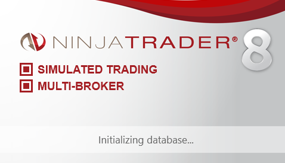
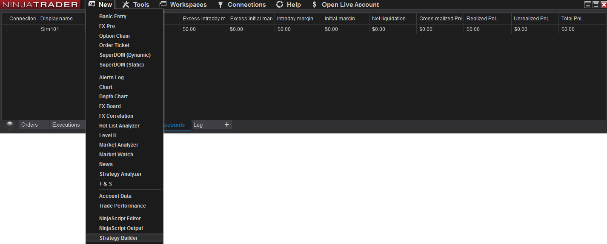
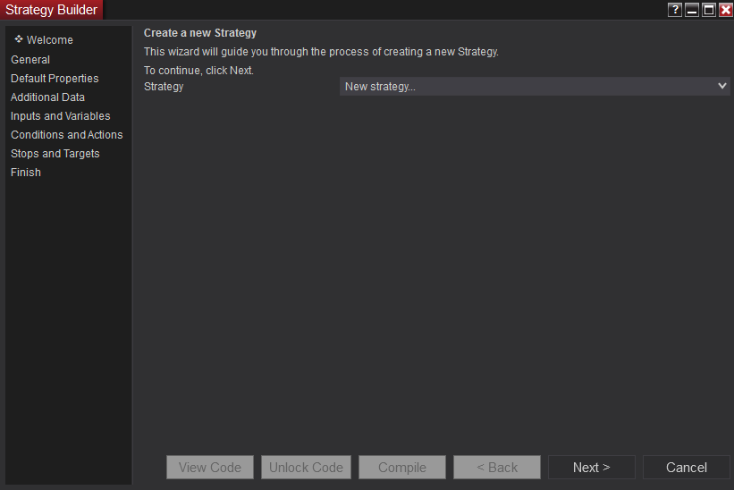
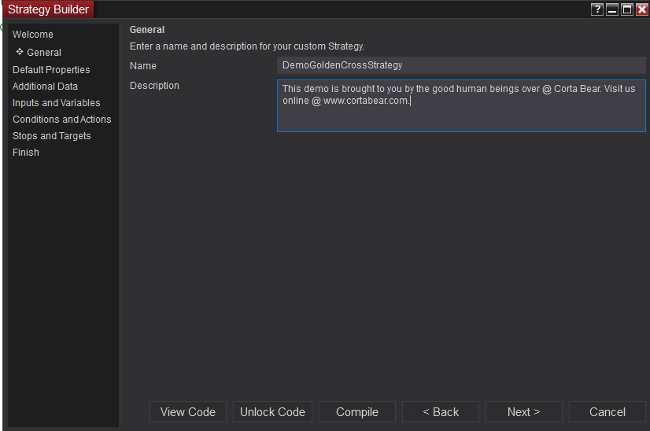
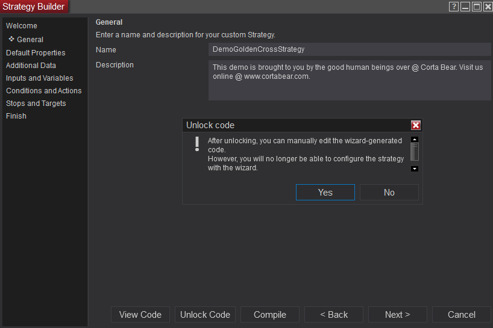
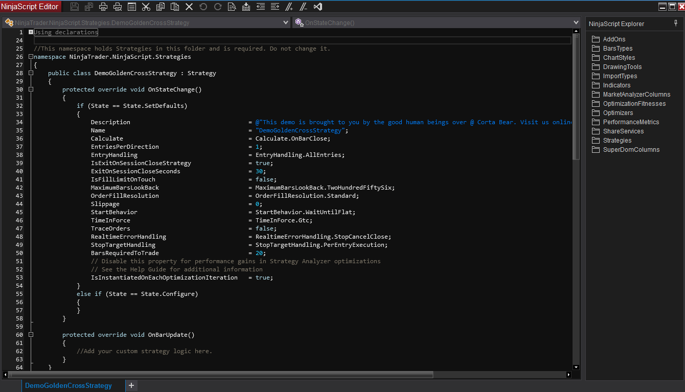
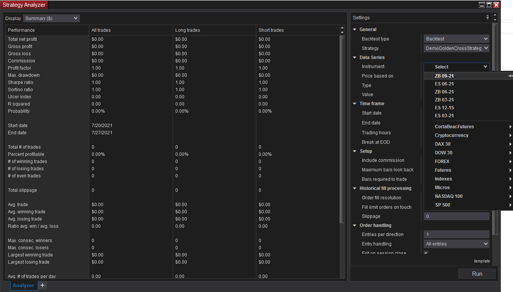

# Strategy : The Golden Cross
The Golden Cross Strategy Demo  
In this demo we will walk through the creation of the infamous '[Golden Cross Strategy](https://etfdb.com/etf-education/3-simple-moving-average-etf-trading-strategies/)' trading strategy using NinjaTrader 8.  

 


## Table Of Conents  
1. [Getting Started](#getting-started)  
1. [Generating A Class](#generating-a-class)


**pseudo-code**  
> IF the simple moving average (SMA) of the 'investment' in a 10 period timespan just moved up and crossed over the simple moving average (SMA) of the 20 period timespan THEN BUY the 'investment'. Set a stop loss at 10% loss and a profit target of 20%.  

> IF a profit target order is generated in addition to a stop loss order, they are submitted as OCO (one cancels other). 

---

## Getting Started 
1. [Prereq](#)  

---  

### Prereq  
**VS Code**  
Any solid IDE would suffice but we would recommend using Microsoft's VS Code editor for MAC, PC.  

[Go Back To The Table Of Contents...](#strategy--the-golden-cross)

NinjaTrader 8 downloaded and installed and hooked up to live data 
NinjaTrader account 

## Generating A Class  
**Launch NinjaTrader 8**  
  

[Go Back To The Table Of Contents...](#strategy--the-golden-cross)  

---  

### Control Center > Strategy Builder  
From the control center, navigate to the [Strategy Builder](#).  
  

The [Strategy Builder](#) wizard will load.  

[Go Back To The Table Of Contents...](#strategy--the-golden-cross)  

---  


### Create a new Strategy  
This wizard guides you though the steps of creating a new strategy.  
* General - Name and description of the strategy.  
* Default Properties -  
* Additional Data -  
* Inputs and Variables -  
* Conditions and Actions -  
* Stops and Targets -  
* Finish -  
  
Click "Next"

[Go Back To The Table Of Contents...](#strategy--the-golden-cross)  

---  
 

### General: Strategy Name & Description  
Enter a name and description for your custom strategy.  
**Name**: 'DemoGoldenCrossStrategy'  
**Description**: 'This demo is brought to you by the good human beings over @ Corta Bear. Visit us online @ www.cortabear.com'  
  
Click "Unlock Code"

[Go Back To The Table Of Contents...](#strategy--the-golden-cross)  

---  
 

### Unlocking Code  
"After unlocking, you can manually edit the wizard generated code. However, you will no longer be able to configure the strategy with the wizard. Do you want to proceed?" Click "Yes"  
  
Click "Unlock Code"

[Go Back To The Table Of Contents...](#strategy--the-golden-cross)  

---  
 

### NinjaScript Editor  
We now have a C# Class that provides us a template for a strategy.
  

**Declarations**  
As with all C# files there are a series of declarations at the top of the file.

The class that has been created inherits from 'Strategy'. 'Strategy' comes from a 'NinjaTrader.Strategy.Strategy' DLL.

**Stadard Variables & Methods**  
Every strategy comes with a default set of variables and methods.

**Initialize()**  
Whenever this strategy is loaded

**OnBarUpdate()**  
Whenever ever the candle closes.  

[Go Back To The Table Of Contents...](#strategy--the-golden-cross)  

---  
 
### Set Stop Loss & Set Profit Target  
We will start by defining the stop loss and profit target. At the time of this writting we choose to execute these globablly rather than executing them on a per trade bases.
```C#  
// ...
else if (State == State.Configure)
{

    /*
    STOP LOSS  
    Setting the stop loss for positions globally.

    Syntax
    - SetStopLoss( CalculationMode mode, double value )
    - SetProfitTarget( CalculationMode mode, double value )
    */
    SetStopLoss( CalculationMode.Percent, .1 );
    SetProfitTarget( CalculationMode.Percent, .2 );

}
// ...
```
See more about the '**SetStopLoss**' method in the NinjaTrader documentation. Visit [SetStopLoss](https://ninjatrader.com/support/helpGuides/nt8/setstoploss.htm).  
See more about the '**SetProfitTarget**' method in the NinjaTrader documentation. Visit [SetProfitTarget](https://ninjatrader.com/support/helpGuides/nt8/setprofittarget.htm).  

[Go Back To The Table Of Contents...](#strategy--the-golden-cross)  

---  
 
### Set Stop Loss & Set Profit Target  
We will start by defining the stop loss and profit target. At the time of this writting we choose to execute these globablly rather than executing them on a per trade bases.
```C#  
// ...
else if (State == State.Configure)
{

    /*
    STOP LOSS  
    Setting the stop loss for positions globally.

    Syntax
    - SetStopLoss( CalculationMode mode, double value )
    - SetProfitTarget( CalculationMode mode, double value )
    */
    SetStopLoss( CalculationMode.Percent, .1 );
    SetProfitTarget( CalculationMode.Percent, .2 );

}
// ...
```
See more about the '**SetStopLoss**' method in the NinjaTrader documentation. Visit [SetStopLoss](https://ninjatrader.com/support/helpGuides/nt8/setstoploss.htm).  
See more about the '**SetProfitTarget**' method in the NinjaTrader documentation. Visit [SetProfitTarget](https://ninjatrader.com/support/helpGuides/nt8/setprofittarget.htm).  

[Go Back To The Table Of Contents...](#strategy--the-golden-cross) 

---  
 
### Setting Up The Golden Cross  
NinjaScript provides a number of methods and properties useful for analyzing and identifying specific conditions within ("Series < T >") collections. Some of these methods test a condition and return true or false, while others return an int-based bar index or other numerical value.
```C#  
// ...

    protected override void OnBarUpdate()
    {
        /*
        SIMPLE MOVING AVERAGE (SMA)
        */
        var sma10 = SMA(10);
        var sma20 = SMA(20);

        // Cross Above?
        if( CrossAbove(sma10, sma20, 1 )){
            EnterLong(); // 
        }
    }

// ...
```
See more about the '**Moving Average - Simple (SMA)**' calculation in the NinjaTrader documentation. Visit [Simple (SMA)](https://ninjatrader.com/support/helpGuides/nt8/moving_average_-_simple_sma.htm).    
See more about the '**Cross Above**' parameter in the NinjaTrader documentation. Visit [Cross Above](https://ninjatrader.com/support/helpGuides/nt8/crossabove.htm).
See more about the '**Enter Long**' parameter in the NinjaTrader documentation. Visit [Enter Long](https://ninjatrader.com/support/helpGuides/nt8/enterlong.htm).

[Go Back To The Table Of Contents...](#strategy--the-golden-cross) 

---  
 
### Compile The Strategy  
The easiest way to compile the strategy in NinjaTrader 8 is to click 'F5'. Should trigger a debug dialog window.

```C#  
// ...

Code Goes Here

// ...
```
See more about the '**Moving Average - Simple (SMA)**' calculation in the NinjaTrader documentation. Visit [Simple (SMA)](https://ninjatrader.com/support/helpGuides/nt8/moving_average_-_simple_sma.htm).

[Go Back To The Table Of Contents...](#strategy--the-golden-cross) 

---  
 
### Strategy Analyzer 
Now that we have our golden cross strategy coded and compiled its time to backtest it against historical stack data to see how well it preforms.  
  
First we want to make sure we are connected to data.  

First step is to launch the [Strategy Analzyer](#) from NinjaTrader's control panel. The strategy analyzer houses the backtester, forward tester and optimizer. Go to "New > Strategy Analyzer".  
   

  
For this demo we will be back testing our stratgy against the [T-Bond](https://www.cmegroup.com/trading/interest-rates/basics-of-us-treasury-futures.html) (ZB-MM-YY) futures financial derivative instrument.
   

See more about the '**Moving Average - Simple (SMA)**' calculation in the NinjaTrader documentation. Visit [Simple (SMA)](https://ninjatrader.com/support/helpGuides/nt8/moving_average_-_simple_sma.htm).

[Go Back To The Table Of Contents...](#strategy--the-golden-cross) 

--- 

## Resources  
1. [NinjaTrader Support Documentation](https://ninjatrader.com/support/helpGuides/nt8/)